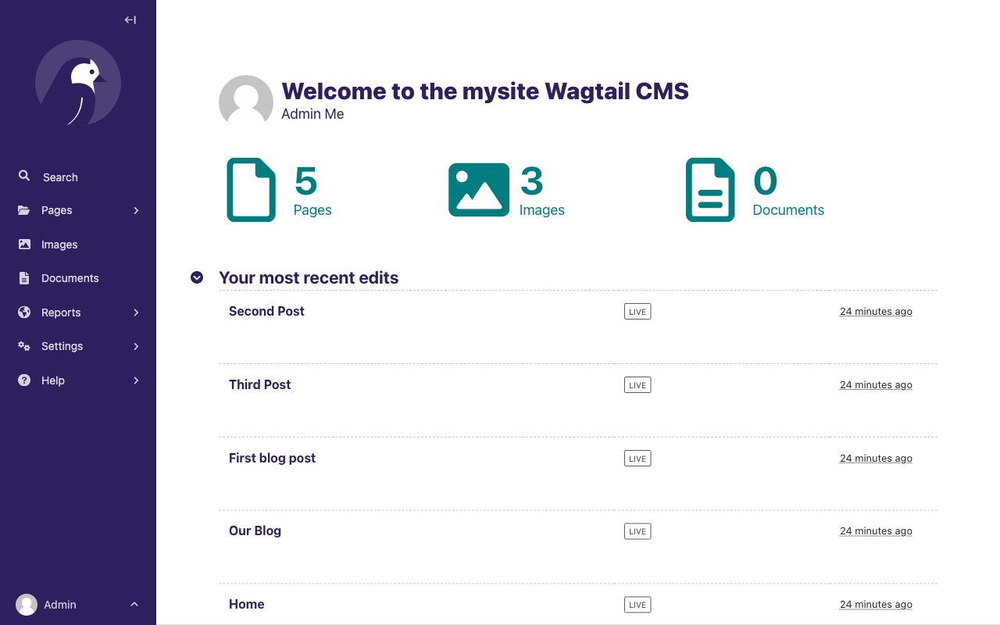
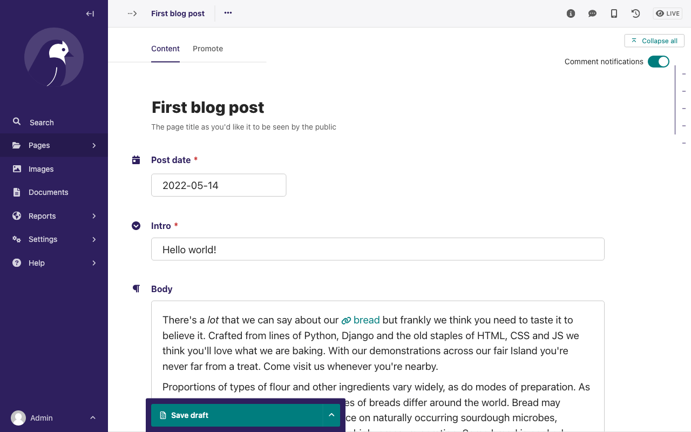

# Best of both worlds: Next.js ❤️ Wagtail – DjangoCon Europe 2023

> Available online at [wagtail.org/nextjs-djangocon](https://wagtail.org/nextjs-djangocon) / [github.com/thibaudcolas/nextjs-loves-wagtail](https://github.com/thibaudcolas/nextjs-loves-wagtail).

👋 welcome to a self-paced headless CMS workshop! This workshop covers:

- Initial project setup: what Wagtail and Next.js are, and how to set them up
- Connecting Next.js with the backend
- Deployment!

The workshop was created for DjangoCon Europe 2023 by [@laymonage](https://github.com/laymonage) and [@thibaudcolas](https://github.com/thibaudcolas) – but we expect it can all be done on your own anytime.

## Ahead of the workshop

Please make sure to have the following installed:

- [Node.js v18 or v20](https://nodejs.org/) (also includes `npm`)
- [Python v3.8+](https://www.python.org/) (also includes `pip`)
- For deployment: [Vercel CLI](https://vercel.com/docs/cli) (and a [Vercel account](https://vercel.com/signup))

## Introduction

- Requirements (see above)
- [Wagtail](https://wagtail.org/) as a CMS: Django, content models, admin.
- [Next.js](https://nextjs.org/) as a framework: React, routing, server-side rendering, static site generation.

All following sections are self-directed! If you have any questions, please raise your hand or ask in the chat.

## Your first Wagtail site

On the command line, let’s start by creating a folder for our project. We’ll use `myproject` in our examples, you can use something more descriptive if you prefer.

```sh
mkdir myproject
cd myproject
```

If you want to use version control, this is a good time to `git init` a new repository. Here is the `.gitignore` contents we recommend:

```text
__pycache__
env
db.sqlite3
/media
/static
```

### Install and run Wagtail

#### Create and activate a virtual environment

We recommend using a virtual environment, which isolates installed dependencies from other projects. We use [`venv`](https://docs.python.org/3/tutorial/venv.html), which is packaged with Python 3.

**On Windows** (cmd.exe):

```doscon
py -m venv mysite\env
mysite\env\Scripts\activate.bat
# or:
mysite\env\Scripts\activate
```

**On GNU/Linux or macOS** (bash/zsh):

```sh
python -m venv env
source env/bin/activate
```

**For other shells** see the [`venv` documentation](https://docs.python.org/3/library/venv.html).

#### Install Wagtail

Use pip to install Wagtail and its dependencies:

```sh
pip install wagtail==5.0.1
```

#### Generate your site

Wagtail provides a `start` command based on `django-admin startproject`. It will generate a new project with a few Wagtail-specific extras, including the required project settings, a "home" app with a blank `HomePage` model and basic templates, and a sample "search" app.

Run `wagtail start` with a project name (we chose `mysite`, you can choose `myproject`, or something else altogether) and the current directory (`.`):

```sh
wagtail start mysite .
```

#### Install project dependencies

This step isn’t needed if you’ve just installed Wagtail in a virtual environment. If you didn’t, make sure to:

```sh
pip install -r requirements.txt
```

#### Create the database

```sh
python manage.py migrate
```

#### Create an admin user

This will prompt you to create a new superuser account with full permissions. Email is optional. Note the password text won’t be visible when typed, for security reasons.

```sh
python manage.py createsuperuser
```

#### Start the server

```sh
python manage.py runserver
```

Then go to the URL given by `runserver` (in our examples we will use <http://127.0.0.1:8000>). If everything worked, it will show you a welcome page:


You can now access the administrative area at <http://127.0.0.1:8000/admin> using the superuser account you created. Here’s what it will look like once we start adding content:



### Extend the HomePage model

Out of the box, the "home" app defines a blank `HomePage` model in `models.py`, along with a migration that creates a homepage and configures Wagtail to use it.

Edit `home/models.py` as follows, to add a `body` field to the model:

```python
from django.db import models

from wagtail.models import Page
from wagtail.fields import RichTextField
from wagtail.admin.panels import FieldPanel


class HomePage(Page):
    body = RichTextField(blank=True)

    content_panels = Page.content_panels + [
        FieldPanel('body'),
    ]
```

`body` is defined as `RichTextField`, a special Wagtail field. When `blank=True`,
it means that this field is not required and can be empty. You
can use any of the [Django core fields](https://docs.djangoproject.com/en/stable/ref/models/fields). `content_panels` define the
capabilities and the layout of the editing interface. When you add fields to `content_panels`, it enables them to be edited on the Wagtail interface. For more information, see [Page models](https://docs.wagtail.org/en/stable/topics/pages.html).

Then run:

```sh
# Creates the migrations file.
python manage.py makemigrations
# Updates the database with your model changes.
python manage.py migrate
```

You must run the above commands each time you make changes to the model definition.

Now edit the homepage within the Wagtail admin area (on the side bar go to _Pages_ and click the edit button beside _Homepage_) to see the new body field. Publish the page by selecting _Publish_ at the bottom of the page editor, rather than _Save Draft_.

We’ll then update `home/templates/home/home_page.html` to contain the following:

```html+django




    <div class="intro">{{ page.body|richtext }}</div>

```

In the above code, we load [Wagtail’s template tags & filters](https://docs.wagtail.org/en/stable/topics/writing_templates.html#template-tags-filters) using ``. This allows the use of the `richtext` filter to escape and print the contents of the `RichTextField`.


### A basic blog

We are now ready to create a blog. We’ll make a separate app:

```bash
python manage.py startapp blog
```

Add the new `blog` app to `INSTALLED_APPS` in `mysite/settings/base.py`.

#### Blog index

Let's start with a simple index page for our blog. In `blog/models.py`:

```python
from wagtail.models import Page
from wagtail.fields import RichTextField
from wagtail.admin.panels import FieldPanel


class BlogIndexPage(Page):
    intro = RichTextField(blank=True)

    content_panels = Page.content_panels + [
        FieldPanel('intro')
    ]
```

Run:

```sh
python manage.py makemigrations
python manage.py migrate
# On Windows:
mkdir blog\templates\blog
type nul > blog\templates\blog\blog_index_page.html
# Other platforms:
mkdir -p blog/templates/blog
touch blog/templates/blog/blog_index_page.html
```

Since the model is called `BlogIndexPage`, we use a template name of `blog_index_page.html`. This default behaviour can be overridden if needed.

In your `blog_index_page.html` file enter the following content:

```html+django




    <h1>{{ page.title }}</h1>
    <div class="intro">{{ page.intro|richtext }}</div>

    
        <h2><a href="">{{ post.title }}</a></h2>
        {{ post.specific.intro }}
        {{ post.specific.body|richtext }}
    

```

Note the `pageurl` tag, which is similar to Django's `url` tag but takes a Wagtail Page object as an argument.

From our public homepage <http://127.0.0.1:8000/>, click the Wagtail bird and then "Add a child page".

- Choose "Blog index page" from the list of the page types. If Wagtail shows a 404 – you forgot to make & run migrations!
- Use "Our Blog" as your page title, make sure it has the slug "blog" on the Promote tab, and publish it.

You should now be able to access the url <http://127.0.0.1:8000/blog/> on your site (note how the slug from the Promote tab defines the page URL). If there is a `TemplateDoesNotExist` exception, it means the template is missing or isn’t being picked up by Django.

#### Blog posts

Now we need a model and template for our blog posts. In `blog/models.py`:

```python
from django.db import models

from wagtail.models import Page
from wagtail.fields import RichTextField
from wagtail.admin.panels import FieldPanel
from wagtail.search import index


class BlogIndexPage(Page):
    intro = RichTextField(blank=True)

    content_panels = Page.content_panels + [
        FieldPanel('intro')
    ]


class BlogPage(Page):
    date = models.DateField("Post date")
    intro = models.CharField(max_length=250)
    body = RichTextField(blank=True)

    search_fields = Page.search_fields + [
        index.SearchField('intro'),
        index.SearchField('body'),
    ]

    content_panels = Page.content_panels + [
        FieldPanel('date'),
        FieldPanel('intro'),
        FieldPanel('body'),
    ]
```

In the model above, we import `index` as this makes the model searchable. You can then list fields that you want to be searchable for the user.

Like for the index page, run:

```sh
python manage.py makemigrations
python manage.py migrate
# On Windows:
type nul > blog\templates\blog\blog_page.html
# Other platforms:
touch blog/templates/blog/blog_page.html
```

Now add the following content to your newly created `blog_page.html` file:

```html+django




    <h1>{{ page.title }}</h1>
    <p class="meta">{{ page.date }}</p>
    <div class="intro">{{ page.intro }}</div>

    {{ page.body|richtext }}

    <p><a href="{{ page.get_parent.url }}">Return to blog</a></p>

```

Note the use of Wagtail's built-in `get_parent()` method to obtain the
URL of the blog this post is a part of.

From <http://127.0.0.1:8000/blog/>, click "Add a child page" again, and this time create a new "Blog Page".

Wagtail gives you full control over what kinds of content can be created under
various parent content types. By default, any page type can be a child of any
other page type.



Publish the blog post when you are done editing. Create more if you feel like it (we’ll use three in our examples).

You should now have the very beginnings of a working blog.
Access <http://127.0.0.1:8000/blog/> again and you should see something like this:


Titles should link to post pages, and a link back to the blog's
homepage should appear in the footer of each post page.

## Your first Next.js site

Like we used `wagtail start`, Next.js also has a project scaffolding command: `create-next-app`. We'll use this to create a new project:

```bash
npx create-next-app@latest --typescript --eslint --tailwind --use-npm frontend
cd frontend
```

For all prompts, you may use the default: `src/` No, App Router Yes, custom import alias No. We create our Next.js site under `frontend`, so Wagtail and Next.js are clearly separated.

All subsequent commands for the Next.js site will be within `frontend`.

```bash
# Run the development server
npm run dev
```

You can visit the Next.js website by accessing <http://localhost:3000>.

To get started with a basic page on Next.js, you can edit `app/page.tsx`. For example, we'll change the existing content to:

```tsx
export default function Home() {
  return (
    <main className="flex min-h-screen flex-col items-center justify-center p-24">
      <div className="relative flex place-items-center">
        <h1 className="text-4xl font-bold mb-8">Welcome! 🎉</h1>
      </div>
      <p className="mb-8">
        This is a website built with Next.js and Wagtail 🐦
      </p>
      <a className="px-4 py-2 rounded border hover:text-blue-100" href="/blog">
        Visit the blog
      </a>
    </main>
  );
}
```

You'll notice that the link to the blog page doesn't work yet. We'll need to create a page for it.

Before that, we will go back to our Wagtail code to enable the REST API so we can use it in our frontend.

## Integrating Wagtail and Next.js

### Enabling the REST API in Wagtail

Wagtail has a built-in REST API that we can use to fetch data from our Wagtail site. To enable it, we need to add `wagtail.api.v2` and `rest_framework` to our `INSTALLED_APPS` in `mysite/settings/base.py`.

```python
INSTALLED_APPS = [
    ...
    'wagtail.admin',
    'wagtail.api.v2',
    'wagtail',
    'rest_framework',
    ...
]
```

Create a `mysite/api.py` file with the following content:

```python
from wagtail.api.v2.views import PagesAPIViewSet
from wagtail.api.v2.router import WagtailAPIRouter
from wagtail.images.api.v2.views import ImagesAPIViewSet
from wagtail.documents.api.v2.views import DocumentsAPIViewSet

# Create the router. "wagtailapi" is the URL namespace
api_router = WagtailAPIRouter('wagtailapi')

# Add the three endpoints using the "register_endpoint" method.
# The first parameter is the name of the endpoint (such as pages, images). This
# is used in the URL of the endpoint
# The second parameter is the endpoint class that handles the requests
api_router.register_endpoint('pages', PagesAPIViewSet)
api_router.register_endpoint('images', ImagesAPIViewSet)
api_router.register_endpoint('documents', DocumentsAPIViewSet)
```

Next, register the URLs so Django can route requests into the API by editing `mysite/urls.py`:

```python
from .api import api_router

...

urlpatterns = urlpatterns + [
    ...,

    path('api/v2/', api_router.urls),

    ...,

    # Ensure that the api_router line appears above the default Wagtail page serving route
    re_path(r'^', include(wagtail_urls)),
]
```

With this configuration, pages will be available at `/api/v2/pages/`.

### Adding API fields to the Wagtail page models

Wagtail only exposes some fields of the base Page model by default. In order to use the fields we defined earlier, we'll need to add them to the API. This can be done by adding an `api_fields` attribute to the model.

For example, in `blog/models.py`, add the following:

```python
...
from wagtail.api import APIField
...


class BlogIndexPage(Page):
    intro = RichTextField(blank=True)

    api_fields = [
        APIField('intro'),
    ]

    ...

...

class BlogPage(Page):
    date = models.DateField("Post date")
    intro = models.CharField(max_length=250)
    body = RichTextField(blank=True)

    api_fields = [
        APIField('intro'),
        APIField('body'),
    ]
```

You will now be able to fetch the pages data through the REST API. For an example query, try visiting <http://localhost:8000/api/v2/pages/?type=blog.BlogPage&fields=intro,body> on your web browser.

### Fetching data from the Wagtail API in the Next.js frontend

We will add a new page to our Next.js site. To do so, create a new `frontend/app/blog` directory and a `frontend/app/blog/page.tsx` inside it.

We'll start off with the following content:

```tsx
export default async function BlogIndex() {
  const posts = [
    {
      id: 1,
      title: "First post",
      intro: "This is the first post",
      meta: {
        slug: "first-post",
        first_published_at: "2022-01-011T09:00:00Z",
      },
    },
    {
      id: 2,
      title: "Second post",
      intro: "This is the second post",
      meta: {
        slug: "first-post",
        first_published_at: "2021-01-011T09:00:00Z",
      },
    },
  ];

  return (
    <main>
      <div className="mb-8">
        <h1>Title</h1>
        <p>Some introduction</p>
      </div>
      <ul>
        {posts.map((child) => (
          <li key={child.id} className="mb-4">
            <a href={`blog/${child.meta.slug}`}>
              <h2>{child.title}</h2>
            </a>
            <time dateTime={child.meta.first_published_at}>
              {new Date(child.meta.first_published_at).toDateString()}
            </time>
            <p>{child.intro}</p>
          </li>
        ))}
      </ul>
    </main>
  );
}
```

You can access the page by going to <http://localhost:3000/blog>. The blog link on the home page of your Next.js website should now also work.

Note that the data is still a placeholder and hardcoded in the Next.js code. We will now continue by integrating the page with Wagtail's REST API.

To do so, we can change the `posts` definition with the following:

```tsx
interface BlogPage {
  id: number;
  meta: {
    type: string;
    slug: string;
    first_published_at: string;
  };
  title: string;
  intro: string;
}

export default async function BlogIndex() {
  const data = await fetch(
    `http://127.0.0.1:8000/api/v2/pages/?${new URLSearchParams({
      type: "blog.BlogPage",
      fields: "intro",
    })}`,
    {
      headers: {
        Accept: "application/json",
      },
    }
  ).then((response) => response.json());

  const posts: BlogPage[] = data.items;

  // The rest stays the same
  // ...
}
```

After you save the file and reload the page, you will notice that the blog index page now uses the data from Wagtail. Great!

We'll just add one more page to complete our Next.js website, which is the blog post itself. Start by creating a new `frontend/app/blog/[slug]` directory and a `frontend/app/blog/[slug]/page.tsx` file. We'll use the following code to fetch the data from Wagtail and render it on the page:

```tsx
interface BlogPage {
  id: number;
  meta: {
    type: string;
    slug: string;
    first_published_at: string;
  };
  title: string;
  intro: string;
  body: string;
}

export default async function Blog({
  params: { slug },
}: {
  params: { slug: string };
}) {
  const data = await fetch(
    `http://127.0.0.1:8000/api/v2/pages/?${new URLSearchParams({
      slug,
      type: "blog.BlogPage",
      fields: ["intro", "body"].join(","),
    })}`,
    {
      headers: {
        Accept: "application/json",
      },
    }
  ).then((response) => response.json());

  const post: BlogPage = data.items[0];

  return (
    <main>
      <div>
        <h1 className="text-4xl font-bold mb-2">{post.title}</h1>
        <time dateTime={post.meta.first_published_at}>
          {new Date(post.meta.first_published_at).toDateString()}
        </time>
        <p className="my-4">{post.intro}</p>
      </div>
      <div dangerouslySetInnerHTML={{ __html: post.body }}></div>
    </main>
  );
}
```

There is one missing piece to this page, though: this page is rendered on-demand at request time. While Next.js does cache the page after the first render, this means that new pages cannot be rendered if the Wagtail server isn't running. To fix this, we can add a `generateStaticParams` function that tells Next.js what pages should be pre-rendered at build time.

Add the following to the bottom of your `frontend/app/blog/[slug]/page.tsx` file:

```tsx
export async function generateStaticParams() {
  const data = await fetch(
    `http://127.0.0.1:8000/api/v2/pages/?${new URLSearchParams({
      type: "blog.BlogPage",
    })}`,
    {
      headers: {
        Accept: "application/json",
      },
    }
  ).then((response) => response.json());

  return data.items.map((post: BlogPage) => ({
    slug: post.meta.slug,
  }));
}
```

And that's it! As long as the Wagtail server is running when the Next.js website is built (with `npm run build`), all of our blog pages will be rendered at build time. This means that the Next.js pages will still work even if you stop the Wagtail server.

## Deployment

We will deploy our Next.js site as a static site on Vercel. Our Wagtail site will not be deployed in this workshop, but you can deploy it by [following the documentation](https://docs.wagtail.org/en/stable/advanced_topics/deploying.html).

Make sure that your Wagtail server is running. Then, run the following command to build your Next.js site:

```bash
vercel build
```

For most prompts, you may use the default:

- Run `vercel pull`? Yes
- Set up `path/to/frontend`? Yes
- You may be asked to sign in to Vercel. Open the provided link to sign in.
- Link to existing project? No
- What's your project's name? Any, e.g. `nextjs-wagtail`
- In which directory is your code located? `./`
- Auto-detected Project Settings (Next.js):
  > - Build Command: `next build`
  > - Development Command: `next dev --port $PORT`
  > - Install Command: `yarn install`, `pnpm install`, or `npm install`
  > - Output Directory: Next.js default
- Want to modify these settings? No

When the build is completed, it should show something like `✅  Build Completed in .vercel/output [4s]`.

Now, run the following command to deploy your Next.js site:

```bash
vercel deploy --prebuilt
```

On a successful deployment, you will be given a production URL. Open it in your browser to see your Next.js site!

### Notes

In this tutorial, the Next.js site is deployed as a static site. This means that the Next.js site is built once, and the built files are served to the user. If you have deployed your Wagtail site, you can use it along with the server-side rendering capabilities of Next.js to create a dynamic site that can be tailored on a per-request basis.

## Resources

- [Official Wagtail documentation](https://docs.wagtail.org)
- [Official Next.js documentation](https://nextjs.org/docs)
- Wagtail demo: [bakerydemo site](https://github.com/wagtail/bakerydemo)
- Wagtail hosting: [Fly.io Wagtail tutorial](https://usher.dev/posts/wagtail-on-flyio/part-1/)
- Wagtail headless: [Are we headless yet?](https://areweheadlessyet.wagtail.org/)
- Wagtail + Next.js boilerplate: [Pipit](https://github.com/Frojd/Wagtail-Pipit)
- Graphene (GraphQL) for Wagtail: [Wagtail Grapple](https://github.com/torchbox/wagtail-grapple)
- Stawberry (GraphQL) for Wagtail: [Strawberry Wagtail (experimental)](https://github.com/patrick91/strawberry-wagtail)
- Next.js utilities for Wagtail: [NextJS Wagtail (experimental)](https://gitlab.com/thelabnyc/nextjs-wagtail)
